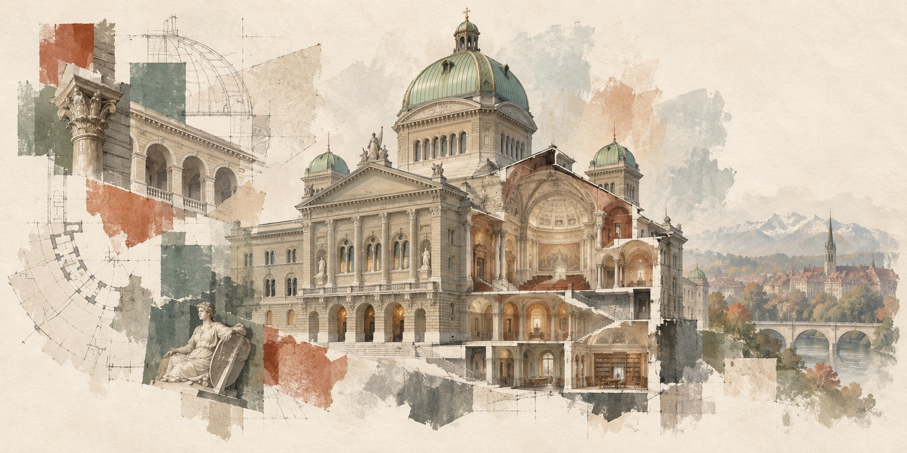

# Reconstructions

  

Experimental 3D reconstructions of Swiss federal buildings, made from publicly available data.

The [gallery](https://bbl-dres.github.io/reconstruction/) links to each reconstruction and shows them as cards or on a map (`#map`). Every reconstruction lives in its own folder under `reconstructions/`, with its own README, tools and documentation.

| Reconstruction | What it is |
|---|---|
| [Bundeshaus](reconstructions/bundeshaus/) | The Swiss Parliament Building in Bern. No-build Three.js viewer with exterior, dollhouse, floor-plan and walk modes, building inventory and IFC download. [Live viewer](https://bbl-dres.github.io/reconstruction/reconstructions/bundeshaus/). |
| [Beatrice von Wattenwyl-Haus](reconstructions/von-wattenwyl-haus/) | Archive of the public Matterport tour and an experiment turning its panoramas into a Gaussian splat. The downloaded tour stays local; the splat viewer is published. |

## Gallery

| Path | Content |
|---|---|
| `index.html` | Gallery page with a Gallery / Map toggle |
| `data/reconstructions.json` | One entry per reconstruction: title, place, summary, link, preview, tags and location (WGS84 `lat`/`lon`, with the geocoded address and its source) |
| `assets/` | Preview images, and the README cover artwork (`hero.jpg`, with its PNG master and generation prompt). A gallery entry may name a `fallback` image, shown where its preview is missing. |
| `js/` | `main.js` (data, gallery, view toggle), `map.js` (map view, loaded on first use), `dom.js` (element helper) |
| `vendor/maplibre-gl/` | [MapLibre GL JS](https://maplibre.org/) 6.11.2 (BSD-3-Clause), checksum in `VERSION.json` |

To add a reconstruction, create a folder under `reconstructions/` with an `index.html` entry point, add a preview image to `assets/` and an entry to `data/reconstructions.json`. Locations come from the [swisstopo search API](https://api3.geo.admin.ch/services/sdiservices.html#search) (`SearchServer`, `type=locations`, `sr=4326`) for the building's address.

The page loads its data with `fetch`, so open it through a web server; locally, `python -m http.server` from the repository root. The map uses CARTO's Dark Matter vector basemap, loaded from CARTO at runtime. Check that [CARTO's basemap terms](https://carto.com/basemaps) fit the intended use before relying on it for a public site.

Viewer links shared before this layout (`…/reconstruction/?version=…&view=…`) are forwarded to the Bundeshaus viewer. For that reason the map view uses `#map`, not a `view` parameter.

## License

Project code: [MIT](LICENSE). Bundled dependencies and third-party material retain their respective licenses and terms; [THIRD_PARTY.md](THIRD_PARTY.md) lists what is committed, what loads at runtime and what stays local. Map data © OpenStreetMap contributors, basemap © CARTO.

Everything committed is published on GitHub Pages. Local outputs, tools, large derived formats (splats, point clouds, plain IFC, archives) and raw third-party downloads are gitignored. The exception is the von Wattenwyl-Haus splat viewers in `reconstructions/von-wattenwyl-haus/viewer/output/`, published with the site. Check `git status` before committing new kinds of files.
