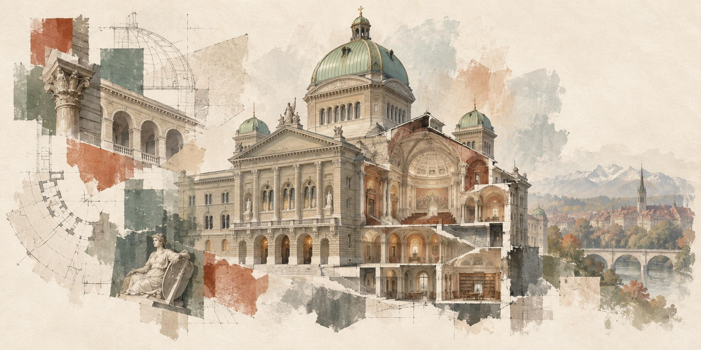
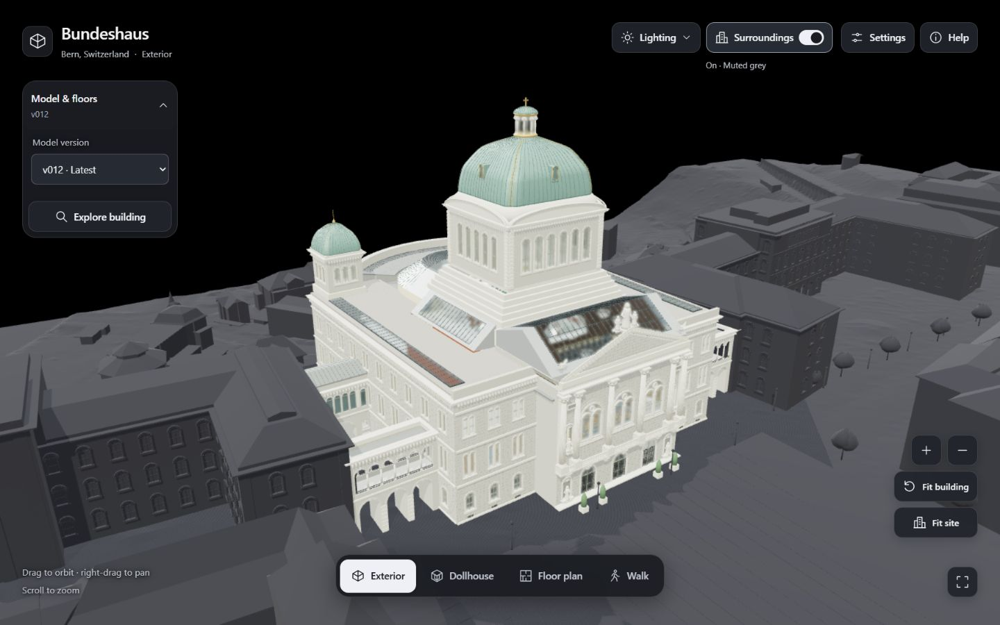
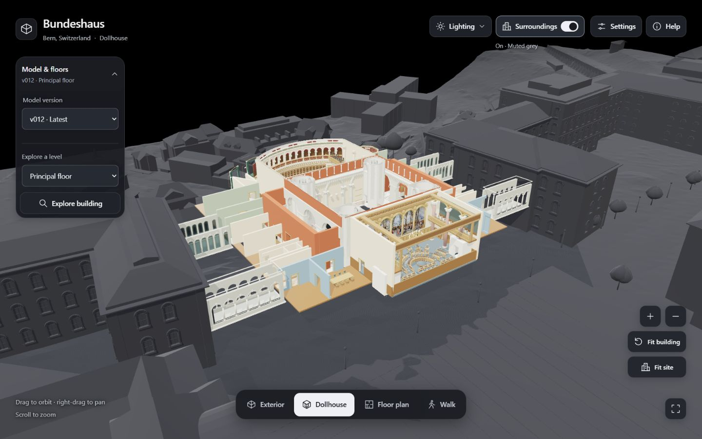
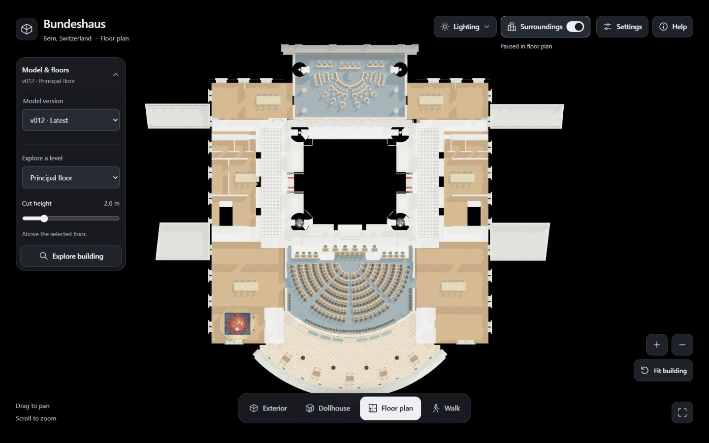
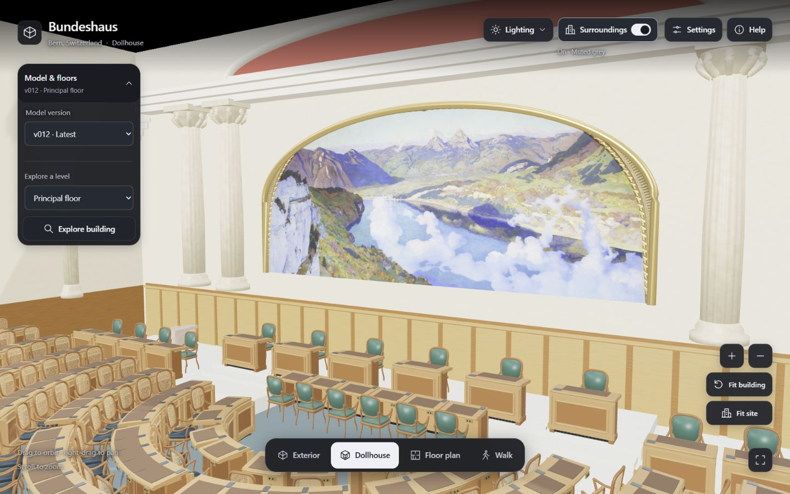
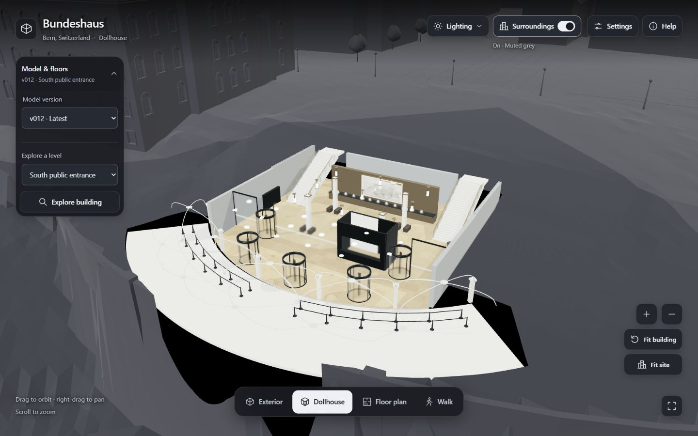
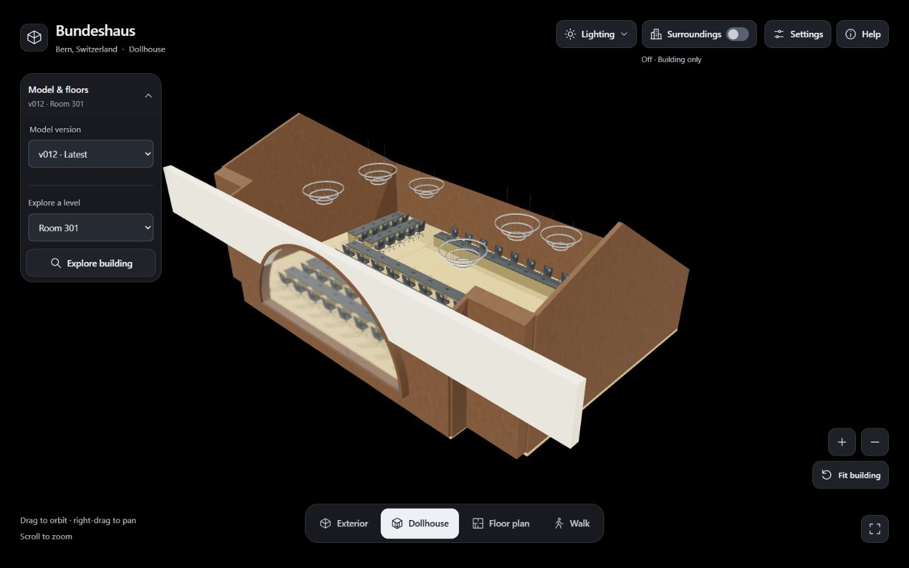

# Project images

[← Project overview](../README.md)

## Cover artwork

[hero.jpg](hero.jpg) · [PNG master](hero.png) · [Generation prompt](hero-prompt.txt)

Created with an image generation tool on 9 September 2026. The 1774 × 887 artwork interprets limestone, patinated copper, arches and layered forms as an architectural painting. It is conceptual cover art. The README uses an optimized, progressive JPEG; the generated PNG is retained.

## Viewer previews

Historical previews captured directly from the local v012 app on 9 September 2026 at **1440 × 900**, with studio lighting and Automatic rendering quality. Exterior, principal-floor Dollhouse, National Council and south entrance use muted surroundings. Floor plan temporarily hides them; Room 301 is shown on its own.

  
  

  
  

| Preview | JPG | PNG copy |
|---|---|---|
| Exterior | [preview-exterior.jpg](preview-exterior.jpg) | [PNG](preview-exterior.png) |
| Dollhouse | [preview-dollhouse.jpg](preview-dollhouse.jpg) | [PNG](preview-dollhouse.png) |
| Floor plan | [preview-floorplan.jpg](preview-floorplan.jpg) | [PNG](preview-floorplan.png) |
| National Council | [preview-interior.jpg](preview-interior.jpg) | [PNG](preview-interior.png) |
| South public entrance | [preview-entrance.jpg](preview-entrance.jpg) | [PNG](preview-entrance.png) |
| Room 301 | [preview-room301.jpg](preview-room301.jpg) | [PNG](preview-room301.png) |

  
  

The browser returned JPEG captures, preserved without re-encoding. PNG companions contain the same decoded pixels. [Capture settings and camera URLs](captures.json) record the original framing. That iteration has been retired from the public catalog; these images remain historical previews.
