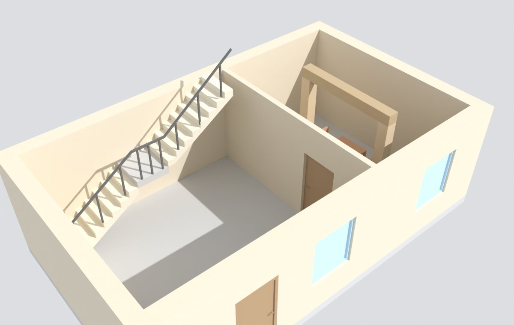

# Examples

[← BIM modelling guide](../README.md)

What correct looks like, as files an agent can open, run and compare against. Everything here is either written for this guide (MIT, like the repository) or downloaded from a public source whose licence allows redistribution; each third-party folder keeps its licence file. Retrieved 2026-10-09.

## Golden example (written for this guide)

An invented two-storey pavilion modelled exactly as the guide asks, as **three federated IFC4 models**. Rebuild it with the BIM Python environment (`tools/model-pipeline/requirements-bim.txt`):

```bash
python docs/bim-modelling-guide/examples/golden/build_golden_example.py
```

| File | Content |
|---|---|
| [golden/build_golden_example.py](golden/build_golden_example.py) | The script: IfcOpenShell API calls for every rule, commented |
| [golden/golden-building.ifc](golden/golden-building.ifc) | Building: 2 storeys; 9 straight wall segments (5 on the ground floor, 4 upstairs), each from the top of the slab to the underside of the slab above; slabs with a stair void; flat roof as `IfcRoof` + roof slab; 2 columns and a beam; 2 doors and 4 windows in openings, typed with shared representation maps; a stair as `IfcStair` with two flights, a landing and a railing; 3 rooms with number, name and net floor area; a table and four chairs of two furniture types; one material per type; `IsExternal`; evidence on every product |
| [golden/golden-site.ifc](golden/golden-site.ifc) | Site: the same `IfcSite` as the building; terrain open under the footprint; entrance path; garden wall split at the gate; a gate; three typed trees |
| [golden/golden-surroundings.ifc](golden/golden-surroundings.ifc) | Surroundings: context terrain and one neighbouring building as typed massing |

All three pass IfcOpenShell schema and rule validation, [`ifc_audit.py`](../../../tools/model-checks/ifc_audit.py) with no warnings and the [IDS files](../ids/README.md) of their model type (`tests/ifc_audit_test.py` checks this). Rebuilding keeps every GlobalId. The coordinates and the LV95 map conversion are example values, not a real site; never copy ids, coordinates or values from the example into a building.



## Blender example (written for this guide)

[blender/build_walls_from_plan.py](blender/build_walls_from_plan.py) builds the golden pavilion's ground floor in Blender the way a building script should: walls from calibrated plan lines as closed quad meshes with real openings (no booleans), door and window types as linked duplicates from the hidden `Types` collection with `viewer_host_id`, the `viewer_*` properties, hygiene asserts and a GLB export with a check that instances share meshes and carry their ids.

```bash
blender --background --python docs/bim-modelling-guide/examples/blender/build_walls_from_plan.py -- out.glb [out.blend]
```

Tested with the `bpy` 5.0.1 module: 9 objects, 7 meshes; the GLB has 9 nodes sharing 7 meshes.

[blender/inspect_objects.py](blender/inspect_objects.py) prints one JSON line of facts per selected object (storey, height above the floor, scale, mirroring, open edges, n-gons, shared mesh, modifiers). Paste it into a Blender MCP code call before and after an edit ([Working in Blender](../blender-workflow.md)).

## buildingSMART sample IFC files

| File | Source | Licence | What to look at |
|---|---|---|---|
| [ifc/buildingsmart/wall-with-opening-and-window.ifc](ifc/buildingsmart/wall-with-opening-and-window.ifc) | [buildingSMART/Sample-Test-Files](https://github.com/buildingSMART/Sample-Test-Files) `IFC 4.0.2.1 (IFC 4 ADD2 TC1)/ISO Spec - ReferenceView_V1.2/`, commit 80d976a (2026-09-04) | CC BY 4.0, © buildingSMART International | The minimal correct pattern: wall → `IfcRelVoidsElement` → opening → `IfcRelFillsElement` → window |
| [ifc/buildingsmart/column-straight-rectangle-tessellation.ifc](ifc/buildingsmart/column-straight-rectangle-tessellation.ifc), [tessellated-item.ifc](ifc/buildingsmart/tessellated-item.ifc), [basin-tessellation.ifc](ifc/buildingsmart/basin-tessellation.ifc) | same folder | CC BY 4.0 | Tessellated (mesh) bodies as the Reference View expects them |
| [ifc/buildingsmart/simple-scene-building-architecture.ifc](ifc/buildingsmart/simple-scene-building-architecture.ifc) | same repository, `Simple-Scene/Building-Architecture.ifc` (SketchUp export, 2026) | CC BY 4.0 | A small IFC4 house; note its 23 % proxies and walls without openings: not everything official is a model to copy |

## Community sample IFC files

From [buildingsmart-community/Community-Sample-Test-Files](https://github.com/buildingsmart-community/Community-Sample-Test-Files), commit 7ddf57a (2024-11-06), CC BY 4.0, © the original authors (see each README). The repository states that most of its samples are not validated.

| File | What to look at |
|---|---|
| [duplex-apartment-architecture-ifc2x3.ifc](ifc/community/duplex-apartment-architecture-ifc2x3.ifc) ([README](ifc/community/duplex-apartment-README.md)) | The classic teaching model (Revit 2011, IFC2X3): 21 spaces, walls as extrusions (`SweptSolid`), every door and window in an opening, stairs with flights, no proxies. Its walls carry no IFC type (an IFC2X3-era Revit export), so do not copy its typing. Attribution: BSI (2020) "Duplex Apartment Test Files," buildingSMART International |
| [gymzaal-amersfoort-georeferenced.ifc](ifc/community/gymzaal-amersfoort-georeferenced.ifc) ([README](ifc/community/gymzaal-amersfoort-README.md)) | IFC4 Revit export with `IfcMapConversion` to EPSG:28992 (corrected by the contributors); 48 spaces; Dutch storey naming "00 Begane grond". Its walls run 20 cm into the storey above and its doors do not fill openings, which the audit reports |
| `iso-*.ifc` | The ISO specification examples (geometryGym, Constructivity): [wall](ifc/community/iso-wall-standard-case.ifc), [slab](ifc/community/iso-slab-standard-case.ifc), [slab with openings](ifc/community/iso-slab-openings.ifc), [column](ifc/community/iso-column-extruded-solid.ifc), [beam](ifc/community/iso-beam-extruded-solid.ifc), [mapped shape with several items](ifc/community/iso-mapped-shape-with-multiple-items.ifc) (how a type's geometry is reused), [geographic referencing](ifc/community/iso-geographic-referencing.ifc). Several use `*StandardCase` classes, deprecated in IFC4 ADD2 TC1: read them for the geometry, write `IfcWall`, `IfcSlab`, `IfcColumn`, `IfcBeam` |

The audit figures of these files compared with the repository's models are in [research/repo-gap-analysis.md](../research/repo-gap-analysis.md).

## buildingSMART IDS examples

[ids-buildingsmart/](ids-buildingsmart/) holds three example IDS files from [buildingSMART/IDS](https://github.com/buildingSMART/IDS) `Documentation/Examples/`, commit 870f9c4 (2026-09-25), **CC BY-ND 4.0**, copied unchanged (no derivatives allowed; write new files instead of editing these):

- `IDS_demo_BIM-basis-ILS.ids`: the Dutch BIM basis ILS, the best-known "minimal consistent LOI" (zero point object, storey assignment, classification);
- `IDS_wooden-windows.ids`: requirements on one element kind;
- `IDS_SimpleBIM_examples.ids`: short, readable specifications.

This guide's own IDS files are in [../ids/](../ids/README.md).

## buildingSMART validation rules

[validation-rules/](validation-rules/) holds rules of the buildingSMART Validation Service from [buildingSMART/ifc-gherkin-rules](https://github.com/buildingSMART/ifc-gherkin-rules), commit 893f827 (2026-07-29), **MIT**: `SPS007` (every element in the spatial structure, aggregated parts not), `SPS003` (containment of assemblies), `BLT003` with `stair_DecompositionTable.csv` (a stair aggregates flights, slabs and railings), `OJT001` (predefined type and object type), and `spatial_CompositionTable.csv`. These are the normative checks a CDE upload may run.

## Agent skills

[agent-skills/](agent-skills/) holds a few exemplary agent instruction files from public repositories (MIT and Apache-2.0, licences kept, provenance in [SOURCES.txt](agent-skills/SOURCES.txt)). They are references for how to write skills for this repository, not skills of this repository. Why these were chosen is in [research/agent-skills.md](../research/agent-skills.md).

| Folder | Shows |
|---|---|
| `text-to-cad/cad/` | A task-routing table, "the model is a script", checks on the saved file, interpreting drawings, a repair loop |
| `sphr/` | Survey intake (Matterport E57, 360 photos, splats): untrusted uploads, routing by input kind, axis conventions, "done means observed in the viewer" |
| `open-architecture-standards-2d-floor-plans/` | Very short progressive-disclosure skills for a floor-plan schema (walls own adjacency, openings by wall id and offset) |
| `compas_ifc/skill/` | An agent-oriented IFC inspection CLI (ETH Zurich) |
| `bonsai-mcp/SERVER_INSTRUCTIONS.md` | Query before edit, IFC-first, aimed screenshots per storey, spatial state returned as text |
