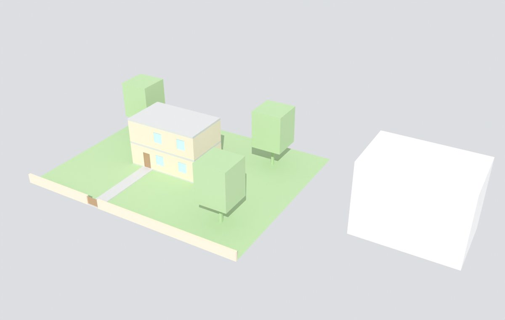

# Federated models: building, site, surroundings

[← BIM modelling guide](README.md) · [Element rules](element-rules.md) · [Mistakes and checks](mistakes-and-checks.md)

A reconstruction consists of three models that are built and released separately and combined (federated) in the viewer and in the CDE. Separate models let several agent teams work at the same time without editing each other's objects, keep each file small, and match how CDEs handle discipline models (one model per discipline and part, in one shared coordinate system).

## The three models

| | Building | Building site | Surroundings |
|---|---|---|---|
| Contains | Everything that is part of the building: walls, slabs, roofs, columns, beams, stairs, openings, doors, windows, finishes, built-in fittings, furniture, rooms; and what is attached to it: entrance steps and ramps on the building, balconies, terraces on the building, canopies, light wells, facade decoration | Everything inside the parcel boundary that is not the building: terrain (open under the footprint), paths, paving, free-standing steps and ramps, garden walls, fences, gates, basins, planters, site furniture, trees and hedges | Everything outside the parcel: terrain, neighbouring buildings, streets, context trees |
| LOD | 200–300 ([guide](README.md#2-level-of-geometry-lod-200-and-lod-300)) | 200; 300 next to the building | 100–200 |
| Spatial structure (IFC) | `IfcSite` (shared) → `IfcBuilding` → `IfcBuildingStorey` → elements and `IfcSpace` | `IfcSite` (shared) → elements contained in the site | own `IfcSite` "Surroundings" → terrain, context `IfcBuilding` → massing |
| Blender collections | `<Part>_<FLOOR>` (`Main_House_EG`), `Types`, `Spaces` | `Site`, `Site_Types` | `Context`, `Context_Types` |
| Script prefix | `b10`–`b49` | `b50`–`b69` | `c` |
| Product ids | `<id>-<part>-<floor>-<kind>-<nnn>` | `<id>-site-<kind>-<nnn>` | `<id>-ctx-<kind>-<nnn>` |
| IDS | [building.ids](ids/building.ids) | [site.ids](ids/site.ids) | [surroundings.ids](ids/surroundings.ids) |
| Audit | `ifc_audit.py --model-type building` | `--model-type site` | `--model-type surroundings` |

**Boundary rules.** An element belongs to the model of the thing it is part of:

- attached to or standing on the building (a step that is part of the plinth, a balcony, an entrance canopy) → building;
- inside the parcel and free-standing (a path, a garden wall, a pergola, a basin) → site;
- outside the parcel boundary → surroundings, even if it touches the parcel (a neighbour's wall on the boundary belongs to whoever owns it; record the decision);
- inside the building footprint at ground level there is no terrain; the building's ground slab is the floor.

When in doubt, write a decision (`research/decisions.json`) and keep the element in one model only. An element modelled in two models is a duplicate and fails the federated check.

## The shared control package

Before any team models, one owner (the *control* role, usually the first agent on a building) produces and freezes the data that all three models use. Nobody changes it without a decision, and every model records which version it used.

| Control data | File (in the building's `work/`) | Used by |
|---|---|---|
| Local origin, axes, georeference (CRS, datum, rotation, map conversion) | `research/derived/model_georeference.json` (exists) | all three; identical `IfcMapConversion` in every IFC |
| Storey list with finished floor levels and bands | `public/building.json` `pipeline.levels` (exists) | building |
| Building footprint at ground level, with the plinth (ground contact) line and its heights | `research/derived/footprint.json` *(proposed)* | building, site |
| Parcel boundary | `research/derived/parcel.json` *(proposed)* from the cadastral survey | site, surroundings |
| Terrain model, clipped per model | `research/derived/terrain/` *(proposed)* from swissALTI3D or the national equivalent | site, surroundings |
| Shared `IfcSite` identity (GlobalId, name) | in `project.json` *(proposed)* | building, site |

The building and the site model write the **same** `IfcSite` (same GlobalId, name and placement), so a CDE shows both under one site. The surroundings model writes its own site. The [golden example](examples/golden/) shows this: `golden-building.ifc` and `golden-site.ifc` share the site `3n99RgJgvM2u2PeqyO31UR`, and all three files carry the same map conversion.

## Interfaces and their checks

The models meet in two places. Each interface has one owner and one check.

| Interface | Rule | Owner | Check |
|---|---|---|---|
| Building ↔ site: plinth | The terrain meets the building along the plinth line, at the footprint's ground contact heights: no gap, no terrain inside the building, no building wall standing in the air | site team (fits terrain to the footprint) | sample the terrain edge along the footprint: height difference to the plinth line ≤ 2 cm; no terrain triangle inside the footprint |
| Building ↔ site: entrances | Entrance steps and doors meet paths at the same height | building team for the steps, site team for the path | path end height = threshold or bottom step height ± 2 cm |
| Site ↔ surroundings: parcel edge | The site terrain and the context terrain share the parcel boundary: same edge vertices and heights, no overlap, no gap | surroundings team (cuts its terrain at the boundary) | boundary vertex heights equal ± 2 cm; no context terrain inside the parcel |
| All: coordinates | Same origin, axes, units and map conversion | control | compare three control points in all three exports (≤ 1 mm) |
| All: duplicates | No element in two models; the reconstructed building is not also in the context data | each team | federated clash and duplicate check (`ifcclash` across the three files) |

## Working in parallel

1. **Control first.** Freeze the control package (version it with a decision). Teams start only from a frozen version.
2. **One team, one model, one master file.** Each team owns its Blender master (`build/model/building.blend`, `site.blend`, `surroundings.blend`) and its scripts. Teams never edit another team's file; they read the other models only as linked, read-only references for alignment.
3. **Ids carry the model.** Product ids include the model's prefix, so ids never collide.
4. **Interfaces by data, not by hand.** The site team fits its terrain to `footprint.json`, not to the building mesh of the day; the surroundings team cuts its terrain at `parcel.json`.
5. **Release together.** A release freezes the three models from the same control version and runs the interface checks on all three.

## How this fits the current pipeline

The pipeline today expects **one** `.blend` per release, exports the `Site` collection with the building GLB and the `Context` collection as the surroundings GLB, and writes one building IFC from the BIM registry. Until it supports three sources:

- **GLB:** a release step (`r05_assemble.py`, *proposed*) appends the frozen site and surroundings collections into the release `.blend`; the existing profiles then export `Site` with the building and `Context` as the surroundings. The viewer shows the same result as today.
- **IFC:** the building IFC comes from the existing exporter. Site and surroundings IFC files need the exporter extension listed in the [gap analysis](research/repo-gap-analysis.md#recommended-pipeline-changes); until then they are not delivered, or are written by a building-specific script following the [golden example](examples/golden/build_golden_example.py).
- **Helper geometry** (walk collision, camera rigs, reference planes) is never part of any of the three models' IFC.
