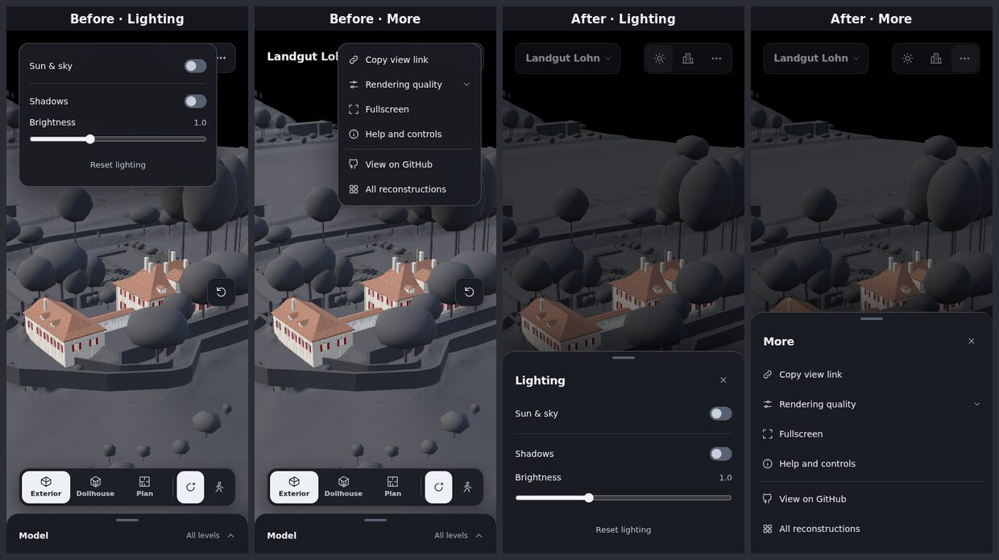
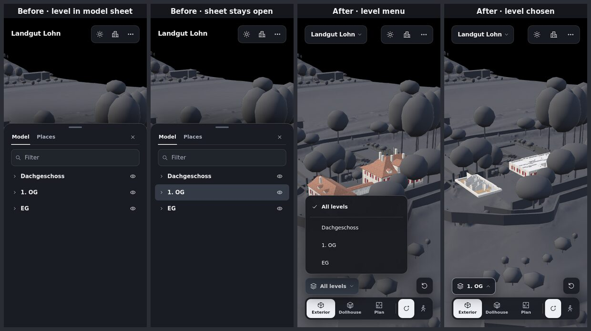
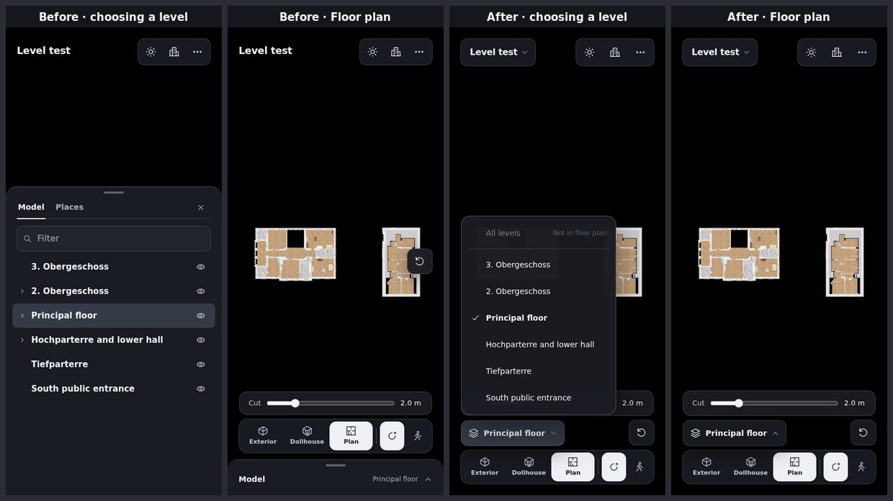
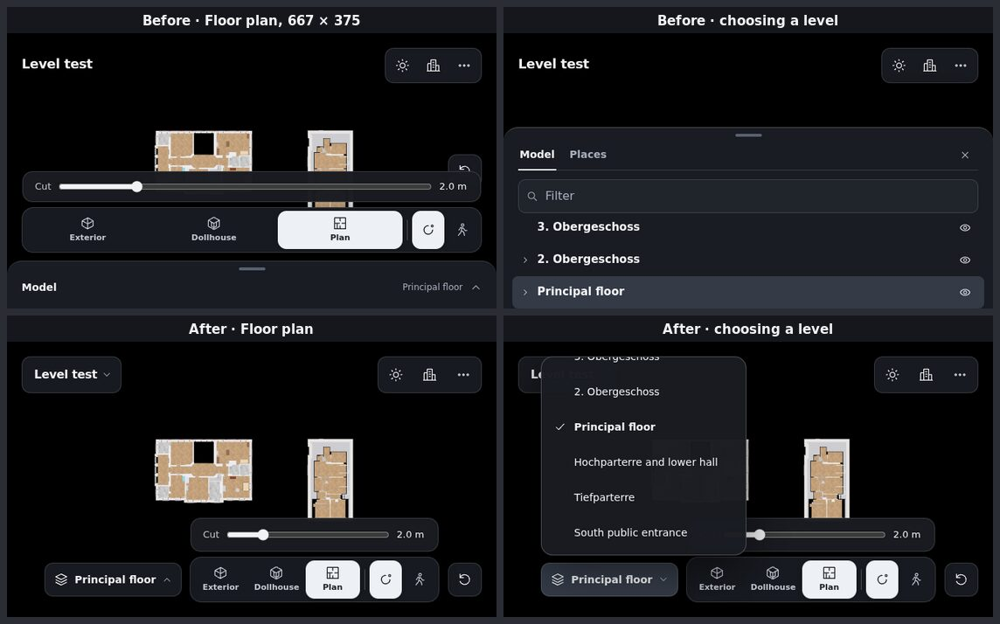
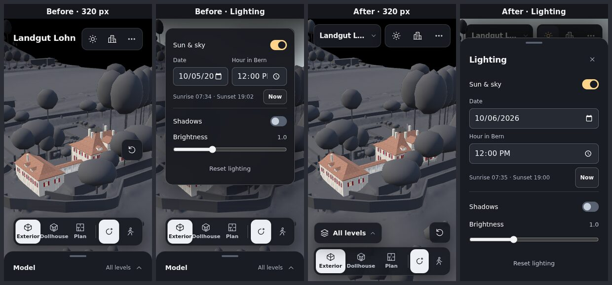
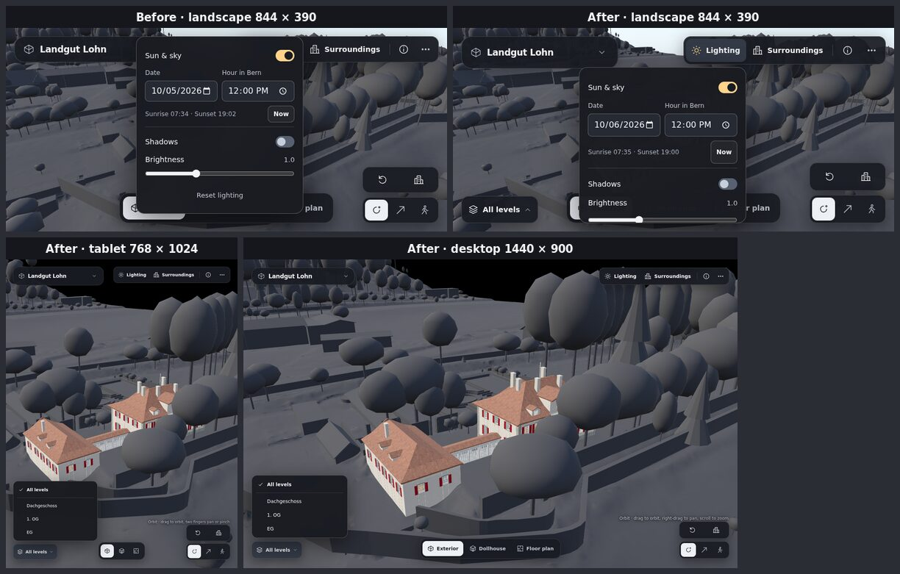

# Responsive and mobile review

[← Viewer guide](viewer-guide.md) · [Project overview](../README.md)

Design and code review of the shared Three.js building viewer ([viewer/](../viewer/)), 5 October 2026, with a focus on responsive layout and phones. It started from two reported problems: the dropdown menus are hard to use on a phone, and choosing a level from the slide-in panel at the bottom works poorly. Both were confirmed and traced to their causes, and the review covered the rest of the touch and small-screen experience as well. The recommendations marked *Changed* are implemented in this revision; the [viewer guide](viewer-guide.md#responsive-behavior-and-accessibility) describes the resulting behavior.

## Summary

The desktop layout is mature: clear zones (model at the top left, environment and settings at the top right, view and navigation at the bottom), consistent tokens, careful keyboard and screen-reader work. The phone layout was a compressed version of it rather than a design for one hand and a small screen. Settings opened at the top edge, out of thumb reach, over the button that opened them, with no visible way to close them. Levels, the most frequent choice in Floor plan, were only reachable through the model tree inside a bottom sheet that covered two thirds of the view. And the permanent controls at the bottom left little room for the building, especially in landscape.

| # | Finding | Severity | Status |
|---|---|---|---|
| 1 | Toolbar dropdowns on phones cover their trigger, have no title or close button and sit out of reach | High | Changed |
| 2 | Level choice is buried in the model tree and its sheet hides the result | High | Changed |
| 3 | Permanent bottom controls take a quarter of a phone's height, half in landscape | High | Changed |
| 4 | Landscape and tablet widths: dropdowns cover their trigger; controls at risk of overlapping | Medium | Changed |
| 5 | Touch targets sized by screen width instead of input | Medium | Changed |
| 6 | Zoom to and Isolate in the tree depend on hover | Medium | Changed |
| 7 | Mobile platform behaviors: pull-to-refresh, tap delay, long-press, sharing, notches | Medium | Changed |
| 8 | Background blur costs frame time on phones for almost no visible effect | Medium | Changed |
| 9 | Accessibility details of the phone layout | Medium | Changed, with open items |
| 10 | 320 px phones: dock labels and the title collide | Low | Changed |
| 11 | Inspector callout overflows short screens | Low | Changed |
| 12 | Code structure and maintainability | Low | Partly changed |
| 13 | Download size and memory on phones | High | Recommendation |

## Method

- Code review of [shell.html](../viewer/shell.html), [token.css](../viewer/css/token.css), [main.css](../viewer/css/main.css), [interface.js](../viewer/js/interface.js), [view-layout.js](../viewer/js/view-layout.js), [main.js](../viewer/js/main.js) and the touch and inspection modules.
- Headless Chromium with software WebGL and touch emulation at 320 × 568, 390 × 844, 667 × 375, 844 × 390, 768 × 1024, 1024 × 768 and 1440 × 900, before and after the changes; every state was captured: toolbar dropdowns, model sheet, level choice, Floor plan, inspector, Walk.
- The Landgut Lohn model, which loads quickly in software rendering, and a local configuration named *Level test* that loads the same model with the Bundeshaus's six level names, the longest in the project. The Bundeshaus model itself (10,901 meshes) is too heavy for software WebGL; it shares the viewer and its layout.
- A scripted touch-target audit, a measurement of the gaps between the bottom controls at twelve widths from 761 to 1440 px, and 30 scripted interaction checks (listed under [Verification](#verification)).

Limits: emulation is not a phone. The headless browser draws text in DejaVu Sans, about 10 % wider than the system fonts of iOS and Android, so text fits better on devices than in these captures. iOS Safari, physical touch, text size settings and screen readers still need a pass on real devices.

## Findings

### 1. Toolbar dropdowns on phones

**Seen.** On a phone, Lighting, Surroundings, More and Help opened at the top edge of the screen ([view-layout.js](../viewer/js/view-layout.js) used the full height for screens up to 420 px wide), right-aligned at their desktop widths of 232–360 px. Each covered the toolbar button that opened it and the building name, so it was no longer clear what had opened, and the button could not be tapped again to close it. There was no title and no close button: Escape needs a keyboard, and the only other way out was to tap the 3D view, which also starts an orbit. The top right corner is the hardest place to reach with one hand. Help described the mouse and keyboard (right-drag, WASD, Q/E) and Fly, which phones do not offer. At 320 px the date and time fields were cut off (`10/05/20`), and the nested quality choice used 13 px radio buttons.

**Changed.** On phones the four dropdowns are bottom sheets: full width at the bottom edge, with a title, a 44 px close button, a dimmed backdrop that closes them on tap without moving the camera, and a handle that closes them when dragged down or flicked. Rows are 48 px; headers stay visible while long content scrolls; the sheet slides in, or simply appears with reduced motion. Help now explains the input in hand: touch gestures on touch screens, mouse and keys elsewhere, and no Fly on phones. Below 360 px the date and time fields stack.

### 2. Level selection

**Seen.** Levels could only be chosen in the model tree, which on phones lived in the bottom sheet. Changing the floor took four steps: open the sheet (66 % of the screen height), find the level row among expand arrows and eye icons, tap it, close the sheet. The sheet stayed open after the choice and covered the result. There was no *All levels* entry; showing everything again meant tapping the chosen level a second time, which nothing explains. In Floor plan, where moving between floors is the main activity, the plan was hidden every time a floor was chosen, and the current floor appeared only in 12 px grey text at the bottom. On tablets the panel starts collapsed, and on desktop it can be collapsed: the current level was then not visible anywhere. A chosen level hides the rest of the building in Exterior and Dollhouse with no visible cue, which reads as missing geometry. A level with nothing on it (Floor plan picks the first listed level when there is no `principal`) gave an empty black view without explanation.

**Changed.** Levels have their own control on every layout: a level button at the bottom left that names the level shown. It opens a short menu right above it, so the view stays visible: *All levels*, then each level from the top down, the current one ticked. Choosing closes the menu. The button's edge lights up while a level hides the rest of the building; in Floor plan *All levels* is disabled with the reason. Page Up and Page Down step through the list on a keyboard, and a level with nothing to show in the view displays a notice instead of an empty screen. The tree's level rows keep working and stay in sync. The menu follows the menu pattern for assistive technology (`menuitemradio`, arrows, Home, End, focus on the current level, focus returned to the button).

Changing the floor in Floor plan on a phone now takes two taps instead of three, and the plan stays in view.

### 3. Room for the building on phones

**Seen.** A permanent "Model · All levels" bar (64 px) plus the dock (62 px) took 138 px at the bottom, 190 px in Floor plan with its cut slider: more than a quarter of the height a phone browser leaves to the page. The bar spent the most reachable area of the screen on a secondary feature, and its level text could not change the level. Fit building floated in the middle of the right edge, over the model; in Floor plan it overlapped the drawing. On a small landscape phone (667 × 375) the plan was visible through a band of about 110 px, and Fit building overlapped the cut slider.

**Changed.** The bar is gone. The building name at the top left opens Model & places, as the panel header does on desktop. The level button and Fit building share one row above the dock, as compact floating buttons rather than a full-width bar, and Floor plan's cut slider sits above them. Small landscape phones place the level button, the dock and Fit building in a single row. The header gradient behind the name is no longer needed: the name is a control with its own background.

### 4. Landscape phones and tablets (761–1099 px wide)

**Seen.** Wider landscape phones (for example 844 × 390) use the floating desktop layout. Their dropdowns also opened at the top edge and covered the toolbar, because the full-height rule applied to every screen up to 500 px high. The tree used desktop row heights on touch screens. A control at the bottom left would collide with the centred dock: measured with long level names, overlaps of up to 82 px between 761 and 1180 px.

**Changed.** On short wide screens dropdowns open below their trigger and scroll. The bottom row is a three-column grid (level button, dock, navigation switch): the dock stays centred and the level button shrinks into the room on its left, ellipsising its label. The measured clearance is at least 12 px at each of the twelve widths measured from 761 to 1440 px, in Exterior and in Floor plan, as the grid guarantees. Starting Walk or Fly closes the floating panel below 1100 px, so it no longer covers the movement pad.

### 5. Touch targets

**Seen.** Sizes switched with the screen width, so tablets received mouse-sized targets. On a phone: 40 px toolbar buttons, 24 px tree arrows, a 36 px sheet close button, 32 px small buttons (*Now*), 40 px switch rows and menu items. On a tablet: 34 px tree rows, 26 px row actions, a 36 px filter field.

**Changed.** Target size now follows the input: a `--target-size` token is 40 px with a mouse and 44 px on touch screens (`pointer: coarse`), used by rows, icon buttons and the navigation switch; tree rows are 44 px on any touch screen. Phone header buttons are 44 px and sheet rows 48 px. After the change no phone target is below 44 px except the tree's expand arrows (40 × 44 px). On tablets the expand arrows (32 × 44 px) and row actions (40 × 40 px) are slightly smaller, inside 44 px rows, to keep the tree readable. All targets exceed the WCAG 2.2 minimum of 24 px.

### 6. Hover-only actions in the tree

**Seen.** Zoom to and Isolate appear when a row is hovered or focused. Phones hid them altogether, and Safari does not focus a button when it is tapped, so on iPhones and iPads Isolate could not be reached.

**Changed.** Tapping a row focuses it, as the keyboard does, and the focused row shows Zoom to and Isolate on touch screens; Show or hide stays on every row.

### 7. Mobile platform behaviors

- **Pull-to-refresh.** A downward drag on the header or a sheet could reload the page, and with it download the Bundeshaus's 111 MB again. *Changed:* `overscroll-behavior: none`.
- **Tap delay.** Controls waited for a possible double-tap zoom. *Changed:* `touch-action: manipulation` on controls; text can still be zoomed.
- **Long press.** A long press on the view or a floating control could select text or open the iOS callout. *Changed:* disabled there; the inspector's text stays selectable for copying IDs.
- **Sharing.** Phones share links through the system share sheet, not the clipboard. *Changed:* on touch devices with the Web Share API, *Copy view link* becomes *Share view link* and opens the share sheet; dismissing it is not treated as an error, and the copy fallback remains.
- **Notches.** Bottom sheets ignored the left and right safe areas in landscape. *Changed.*

### 8. Background blur

**Seen.** Every floating control and panel uses `backdrop-filter: blur(20px)` behind fills that are 93–98 % opaque. The blur is barely visible, but it is recomputed for every frame while the view moves, which costs GPU time and battery on phones.

**Changed.** Touch screens skip the blur; desktop keeps it.

### 9. Accessibility

**Changed.**
- The phone layout hid the panel header visually but left its collapse button in the Tab order, an invisible tab stop. It is removed from the phone layout; the page heading stays for screen readers.
- The model sheet closes with Escape (after the filter is cleared) and returns focus to the building name; a closed sheet can no longer be reached by Tab.
- The building name button's accessible name includes the visible name ("Landgut Lohn: model and places"), as WCAG 2.5.3 requires.
- The level menu is a menu of radio items with arrow, Home and End keys, as described in finding 2.

**Open.**
- Sheets are popovers, not modal dialogs: content behind the dimmed backdrop stays reachable by screen readers. Making them modal (a `<dialog>` with `showModal()`) is worth a separate change with device testing.
- German level names (*Dachgeschoss*, *2. Obergeschoss*) are read with English pronunciation; level definitions have no language field.
- Text size settings (200 %), browser zoom and screen readers on devices still need a pass, as the viewer guide already requires.

### 10. 320 px phones

**Seen.** "Exterior" and "Dollhouse" ran into each other in the dock, and the building name was cut by the toolbar.

**Changed.** Below 360 px the outer margins are 12 px, the navigation buttons 40 px wide (still 52 px tall) and the view labels have no side padding; the name ellipsises inside its own button. With the wider test font "Dollhouse" still fits only just; with the system fonts of phones it has room.

### 11. Inspector on short screens

**Seen.** At 844 × 390 the element callout reached over the dock; on phones, with *Properties & sources* open, it could reach the level row. Opening *In tree* left the callout half covered by the sheet.

**Changed.** The callout is limited to the space between the toolbar and the bottom controls, and its details scroll. On phones it steps aside while Model & places is open and returns when the sheet closes. A bottom card, the common phone pattern, would collide with the dock; keep the top placement until devices say otherwise.

### 12. Code

- **Dead code.** `wireResponsiveLayout()` wrote four `--viewport-*` CSS variables on every resize and scroll that no stylesheet read. *Changed:* removed.
- **Position arithmetic.** The camera rail, navigation hint and walking actions were placed with hand-written sums of other controls' sizes, such as `2 * (40px + 8px + 2px) + 8px`; any size change had to update all of them. *Changed:* they derive from `--target-size`; the bottom row is a grid; phone rows derive from `--compact-row` and `--compact-stack`. *Recommended:* grid areas for the bottom-right stack as well.
- **Two definitions of "phone".** `popupPlacement` treated screens up to 420 px wide as phones, CSS up to 760 px. Now CSS owns the phone presentation and the function only decides placement; keep a single source when this changes again.
- **main.js size.** About 1,700 lines combine the tree view, inspector, levels, lighting and wiring. *Recommended:* extract the tree view and the inspector into modules with their own tests, as was done for the level logic ([levels.js](../viewer/js/levels.js)).
- **Unused tokens.** [token.css](../viewer/css/token.css) defines nine values nothing reads (`--blur-control`, `--color-backdrop`, `--color-daylight-border`, `--color-surface-selected-hover`, `--icon-size-large`, `--layer-sticky`, `--space-10`, `--space-12`, `--weight-medium`). *Recommended:* remove them or put them to use; the sheets' backdrop uses a literal colour because `::backdrop` does not inherit tokens in every browser.
- **Cache busting.** The Bundeshaus page versions its stylesheets and `boot.js`; Landgut Lohn and the template do not, so for up to the cache lifetime those pages can combine an old `boot.js` with new files. *Recommended:* one approach for every building page, set in one place.

### 13. Download size and memory (recommendation)

The Bundeshaus downloads 85.8 MB for the building and 25.5 MB for its surroundings (compressed) with no warning, which is slow and costly on a mobile connection. Recommended: state the size before loading on connections that report `saveData` or a cellular type, load surroundings only on request in that case, and consider a lighter phone version from the model pipeline. The 10,901 meshes and their textures also approach the WebGL memory available to iOS Safari; the viewer handles a lost graphics context with a message and reload, but defaults (quality, shadows) could use `navigator.deviceMemory`. Both need measurements on real phones before targets are set.

## Before and after

Captures before (left) and after (right) the changes, from the same headless browser. Screens titled *Level test* use the local configuration with the Bundeshaus's level names described under [Method](#method).

**Phone dropdowns** (390 × 844): Lighting and More covered the toolbar; now they are bottom sheets.

**Choosing a level on a phone** (390 × 844): the model sheet covered the view and stayed open; now a short menu opens above the level button.

**Floor plan with long level names** (390 × 844).

**Small landscape phone** (667 × 375): the plan was visible through a narrow band and Fit building overlapped the cut slider; now level, dock and Fit building share one row.

**320 px phone**: dock labels collided and the date was cut off.

**Landscape phone, tablet and desktop**: Lighting covered its trigger in landscape; the level button sits at the bottom left on every layout.

## Verification

- `node --test --experimental-test-isolation=none tests/*.test.mjs` (Node 22; `--test-isolation=none` on Node 23 and later): 118 tests, 109 passed, 9 skipped (they need the local model archive), none failed. The Python tests pass. New: [levels.test.mjs](../tests/levels.test.mjs) for level order and stepping, and in [interface.test.mjs](../tests/interface.test.mjs) the upward level menu, landscape anchoring and the sheet markup.
- 30 scripted browser checks: sheets close by button, long drag and flick but not by a short slow drag; the backdrop restores the trigger state; the model sheet opens from the name and closes by handle tap and Escape, with focus returned and the closed sheet unreachable; the level menu opens with Enter on the current level, moves with the arrows and chooses with Enter; Page Up and Page Down step through levels; Floor plan disables All levels and reports an empty level; Help shows touch text on phones and pointer text on desktop; the desktop level menu opens directly above its button and Escape returns focus.
- Bottom-row clearance measured at twelve widths from 761 to 1440 px in Exterior and Floor plan with the longest level name: at least 12 px everywhere, where a level button simply placed at the bottom left overlapped the dock by up to 82 px.
- Touch-target audit at 390 × 844 and 768 × 1024, as listed under finding 5.
