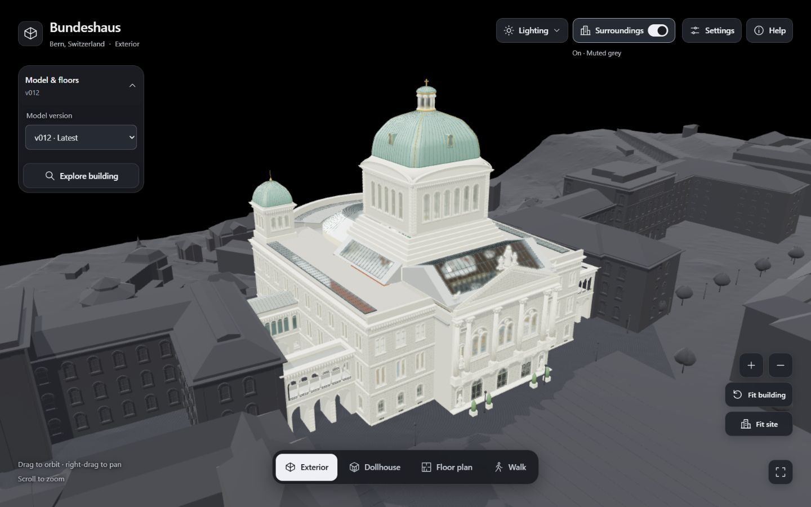
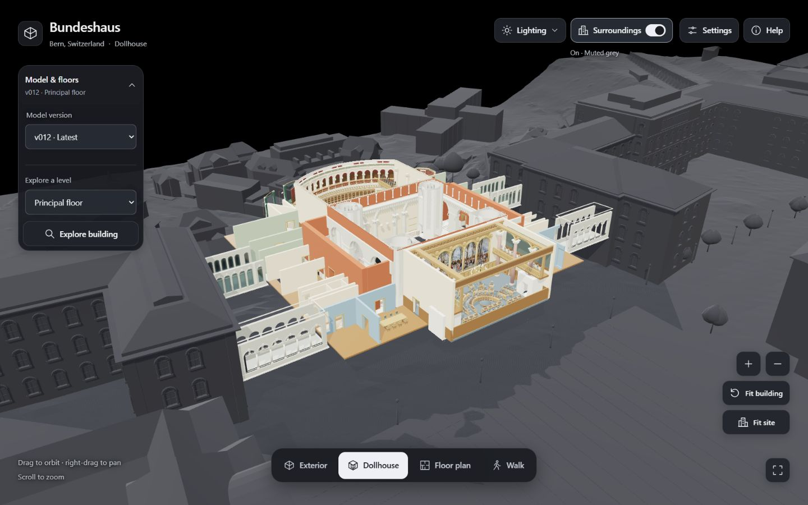

# Bundeshaus · Building explorer

<p align="center">
  <a href="https://bbl-dres.github.io/reconstruction/reconstructions/bundeshaus/">
    
  </a>
</p>

[](https://bbl-dres.github.io/reconstruction/reconstructions/bundeshaus/)
[](../../LICENSE)

> [!WARNING]  
> Only publicly available data was used, the model is not survey grade accurate.

Explore an evolving 3D reconstruction of the Swiss Parliament building in Bern. Built with **vanilla JavaScript and Three.js**, with models and runtime dependencies stored in this repository. No build step or npm install.

## Demo

Live app: https://bbl-dres.github.io/reconstruction/reconstructions/bundeshaus/

<p align="center">
  <a href="public/previews/preview-exterior.jpg"></a>
  <a href="public/previews/preview-dollhouse.jpg"></a>
</p>

Viewer captures. The cover is conceptual artwork; [more previews and image details](public/previews/README.md).

## How this was made

A large language model (LLM) researched publicly available data to reconstruct the Bundeshaus using 3D modeling software. Successive iterations are exported to GLB; the viewer publishes the latest.

This is an experimental reconstruction: dimensions, unseen spaces and some element properties are inferred. It is incomplete and is not a surveyed BIM model.

## Features

- **Four views:** Exterior, Dollhouse, Floor plan and Walk, with continuous camera framing.
- **Explore and inspect:** saved viewpoints, points of interest, highlighted elements and BIM-style family/type information.
- **Reviewed product inventory:** whole-object selection and counts independent of visible floors. [Full-building IFCZIP downloads](public/README.md) include explicitly unclassified reference geometry. [Coverage and limitations](../../docs/model-handoff.md#product-registry-and-quantities).
- **Share a view:** copy a link with the current view and camera.
- **Set the scene:** optional surroundings, muted context, sun, sky and shadows with date/time controls.
- **Desktop and touch controls:** responsive panels, keyboard navigation and adjustable rendering quality.

## Run locally

From the repository root:

```sh
python tools/serve.py --building bundeshaus
```

Open [localhost:8000/reconstructions/bundeshaus/](http://localhost:8000/reconstructions/bundeshaus/). Edit HTML, CSS or JavaScript and refresh; use `--port 8001` for another port. Opening `index.html` through `file://` does not support model loading.

## Folder layout

| Path | Content |
|---|---|
| `index.html` | Thin entry page for the shared viewer in [`viewer/`](../../viewer) |
| `public/building.json`, `public/about.html` | Name, place, links, export settings and the help text for this building |
| `public/models/` | Published catalog and versioned GLB, BIM and IFCZIP assets ([downloads](public/README.md)) |
| `public/policy/` | Bundeshaus-specific cutaway, floor and walking rules for its legacy geometry |
| `public/profiles/` | Export profiles for [`tools/model-pipeline`](../../tools/model-pipeline) |
| `public/previews/`, `public/docs/` | Viewer captures; [model status](public/docs/model-status.md) |
| `work/` | Gitignored authoring workspace: references, research, stages, frozen versions, archived models. Never published |

## Documentation

- [Viewer guide](../../docs/viewer-guide.md) — usage, development, runtime performance and responsive design.
- [Model handoff](../../docs/model-handoff.md) — BIM families, model performance, conversion, annotations and IFC reference delivery.
- [Model status](public/docs/model-status.md) — Bundeshaus release status, review findings and floor schedules.

## License

Project code: [MIT](../../LICENSE). Bundled dependencies and third-party reference material retain their respective licenses and terms.

[Third-party technology acknowledgments](../../viewer/THIRD_PARTY.md) lists the libraries used by the 3D viewer.
