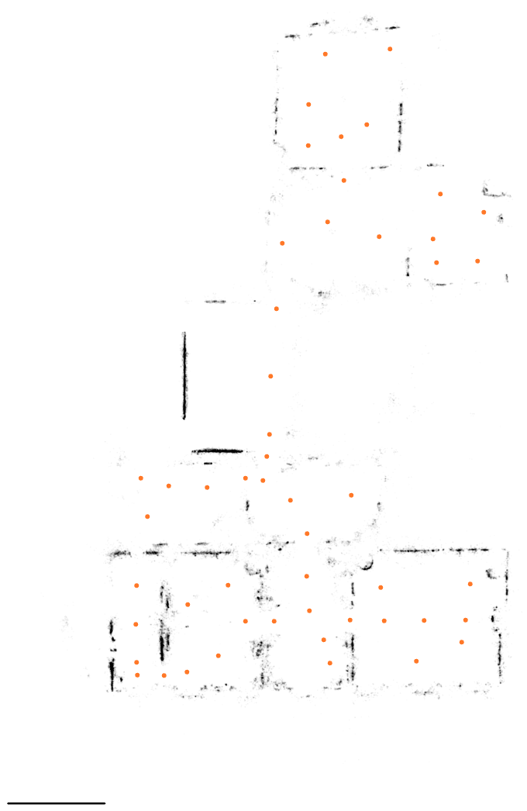

# Floor plans

[← Findings](README.md)

Could we derive floor plans from the capture ourselves, as Splat Labs' [automatic floor plan generator](https://www.splatlabs.ai/features/automatic-floor-plan-generator) does? Analysis and a quick probe, October 2026.

## Summary

- **Splat Labs' generator produces a picture, not a measured plan:** a top-down PNG of a splat in one of 15 AI-generated styles. Real-world measurements and DXF/DWG export are "in development" on their page.
- **A comparable plan picture is 1–2 days of work; a measured vector plan for this house 1–2 weeks;** a general tool for any building would take months.
- **The splat is a poor source for walls.** Plain white walls are textureless, so the splat puts few solid Gaussians there. The archived Matterport mesh, built from depth sensors, is the better source.
- **Accuracy would be Matterport's** (a few centimetres to about 1 %), not survey grade. If BBL holds CAD plans of the house, aligning the splat to them is easier and more accurate.

## Probe: slicing the splat

Solid, flat Gaussians (opacity above 0.25, thinnest axis under 4 cm) between 1.2 and 2.0 m above each floor, drawn from above at 2 cm per pixel. Orange dots are the capture positions; the bar is 5 m.

The room layout is readable, but walls come out as fragments with large gaps. A colour view from above (Gaussians up to 2.1 m, ceiling removed) was noisy without a proper renderer; an orthographic render through the splat renderer would look much better.

## What the archive provides

| Data | Use for a plan |
|---|---|
| Matterport mesh (`.dam`, 50k triangles), built from the camera's depth sensors | Wall lines from a horizontal slice; walls should be continuous even where they are white. Matterport's own format; reading it is not yet checked |
| Per position: the floor point under the camera, its room and links to neighbouring positions | Floor heights; seeds for room segmentation; a link between two rooms marks a doorway |
| Matterport floor areas (Floor 1: 289.8 m², Floor 2: 328.0 m²) and per-room areas and ceiling heights | A check for derived room areas |
| Room outlines (`GetRoomBounds`) | Empty for this tour |
| Automatic room tags | Unreliable ("bathroom" eight times) |

## Effort

| Level | What | Effort |
|---|---|---|
| Plan picture | Top-down render of the splat per floor with the ceiling removed, scale bar and capture positions; close to Splat Labs' base output. Needs the GPU renderer | 1–2 days |
| Measured plan for this house | Slice the mesh at about 1.5 m and straighten the walls; find rooms from the capture positions and doorways from the neighbour links; export SVG/DXF with room areas and check them against Matterport's; some manual clean-up | 1–2 weeks |
| General automatic tool | Research models such as RoomFormer exist, but are trained on synthetic modern apartments and struggle with thick, irregular walls in old buildings. AI-styled renderings would invent detail | Months |

Suggested start: the plan picture, then decide whether a measured plan is worth it.
